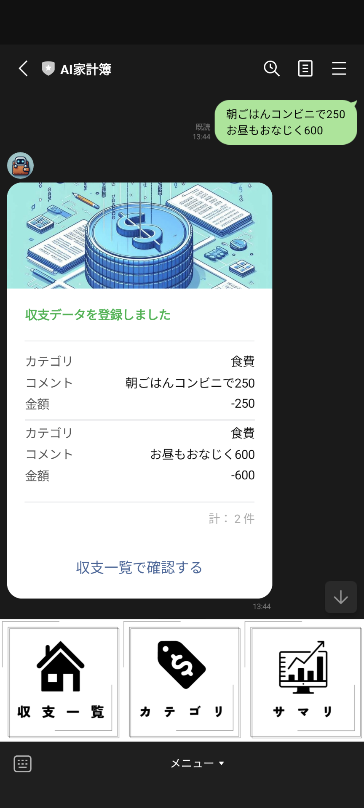
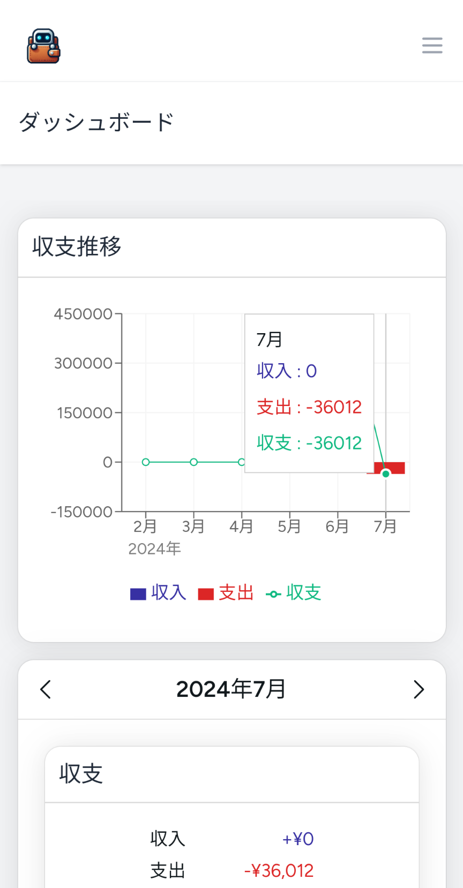
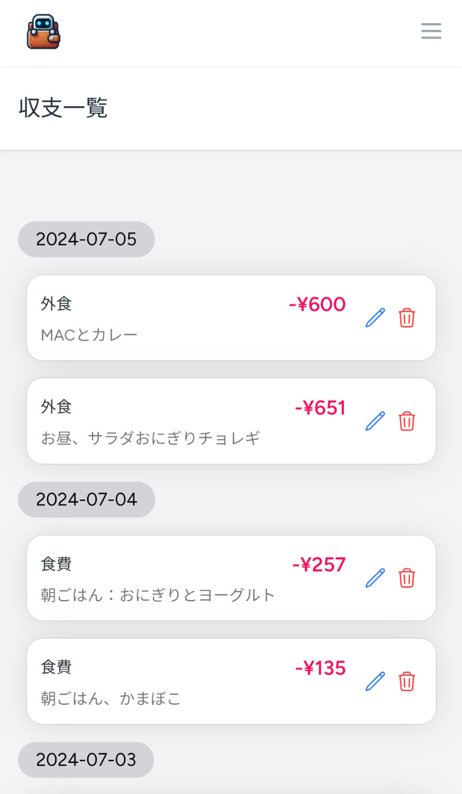
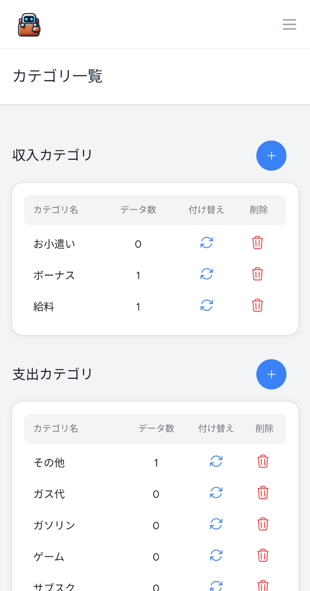

# AI家計簿

<p align="center">
  
</p>

<p align="center">
  
  
  
  
</p>

AI家計簿は、 _誰でも続けられる家計簿_ をモットーに開発されたWebアプリケーションです。

# ✨ 主な機能

## 1. 👤 LINE認証

- 面倒な登録は必要ありません、AI家計簿を友達登録するだけで利用できます。

## 2. 🤖 AIアシスタント・チャットボット

- LINEで瞬時に収支記録
- AI支出パターン分析（Coming Soon!）
- 家計改善提案（Coming Soon!）
- Q&A（Coming Soon!）



## 3. 📊 ダッシュボード

月単位での収支データのサマリを表示します。

- 収支推移グラフ
- 収支サマリー
- 支出内訳円グラフ



## 4. 💳 収支管理

- 簡単な編集・削除機能




## 5. 🏷️ カテゴリ設定

- カスタムカテゴリの作成・編集




# 🛠️ 使用技術

| 技術                                                                                                     | 用途                 |
| -------------------------------------------------------------------------------------------------------- | -------------------- |
|  | バックエンド         |
|       | フロントエンド       |
|   | AI                   |
|           | メッセージ・ログイン |

# 🚀 環境構築

<details>
<summary>📘 クリックで表示</summary>

1. **クローン**:

   ```bash
   git clone https://github.com/SHNakajima/account-book.git
   ```

2. **セットアップ**:

   ```bash
   composer install
   npm install
   cp .env.example .env
   php artisan key:generate
   php artisan migrate
   ```

3. **起動**:
   ```bash
   npm run dev
   php artisan serve
   ```

</details>

# 🤝 問い合わせ

[GitHub issues](https://github.com/SHNakajima/account-book/issues)でお気軽にご連絡ください。

- 新しいアイデア
- 改善点がありましたら
- 質問

を受け付けています。
